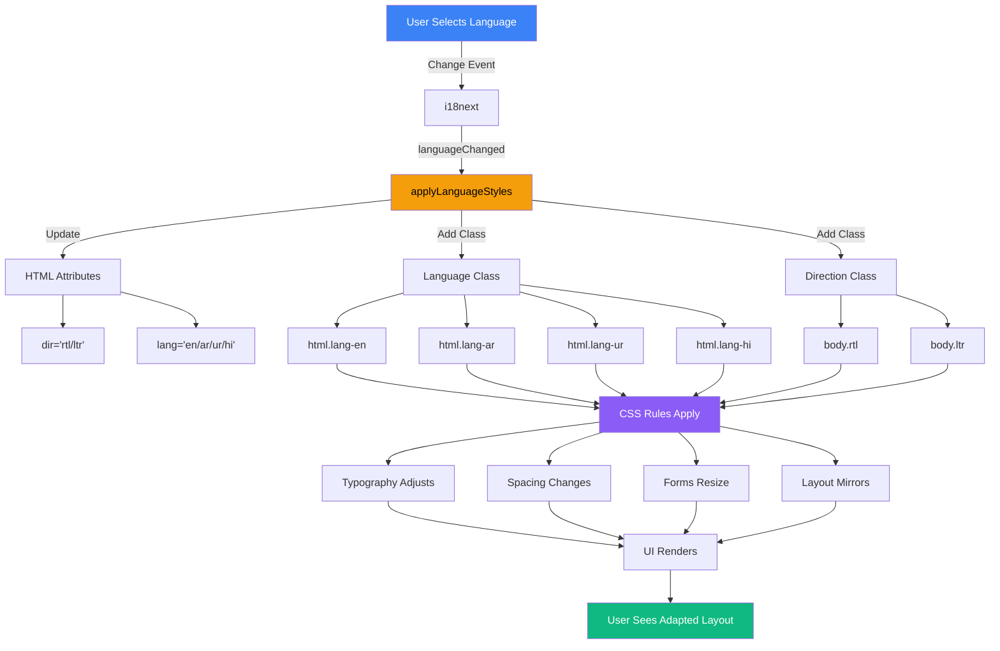
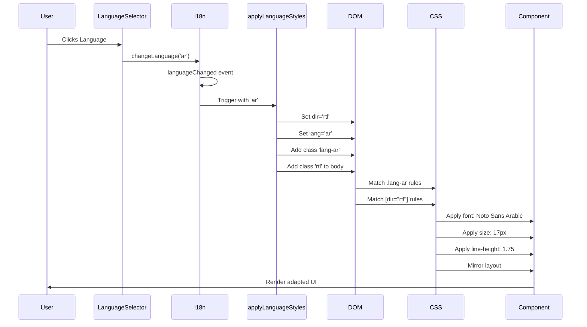
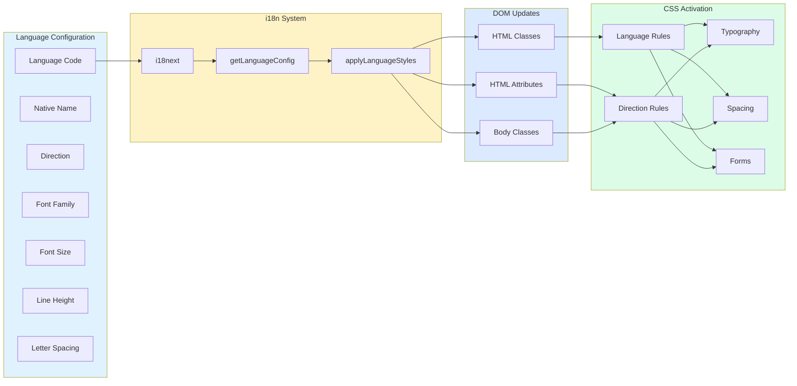
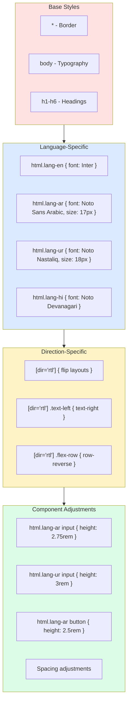
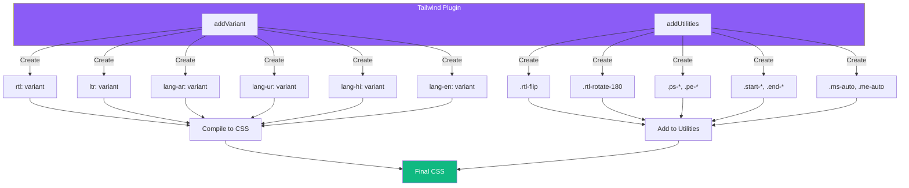
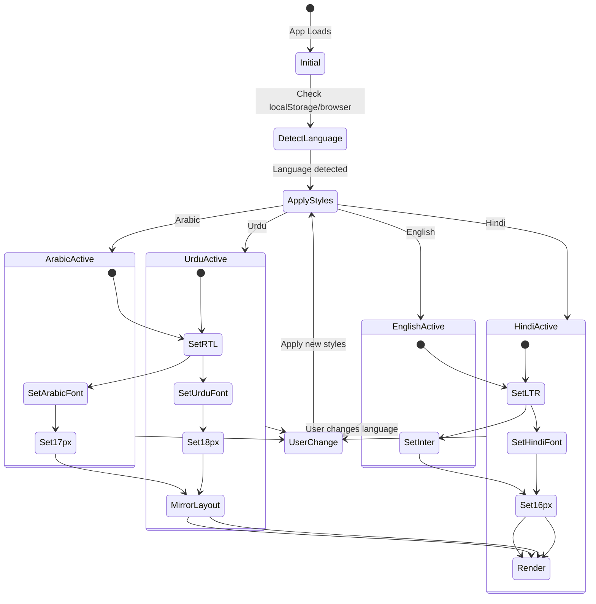
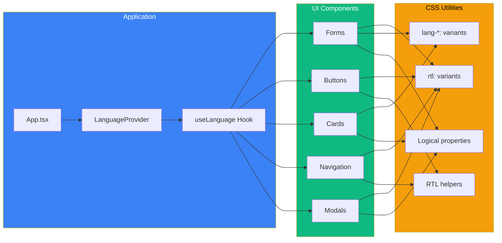
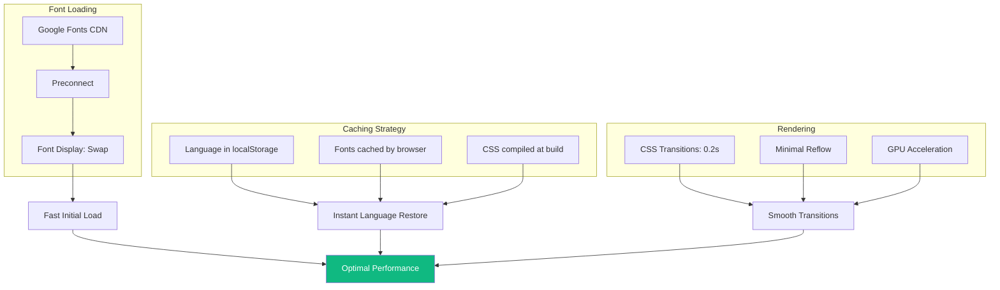

# Language Adaptation Architecture

## System Architecture Diagram



## Component Flow



## Data Flow



## CSS Cascade



## Tailwind Plugin System



## Runtime Behavior



## Component Integration



## Performance Optimization



## Key Advantages

1. **Automatic**: No manual intervention required
2. **Performant**: Pure CSS, no runtime overhead
3. **Maintainable**: Centralized configuration
4. **Scalable**: Easy to add new languages
5. **Consistent**: Design system preserved across languages
6. **Developer-Friendly**: Simple APIs and utilities

## Critical Paths

### Language Change Path
```
User Action → i18n Event → applyLanguageStyles() → DOM Updates → CSS Activation → UI Re-render
```

### Component Render Path
```
Component Mount → useLanguage Hook → Get Config → Apply Classes → CSS Rules Match → Render
```

### Style Application Path
```
HTML Class Added → CSS Selector Matches → Styles Applied → Browser Paint → User Sees Change
```
